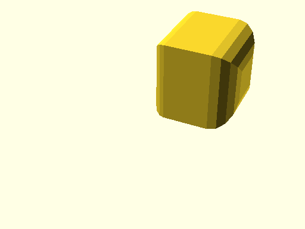

# qbCube

Links: ([source](https://github.com/little-blossom/openscad-qbase/blob/master/qbCube.scad)) ([raw source](https://raw.githubusercontent.com/little-blossom/openscad-qbase/master/qbCube.scad)) ([package overview](overview.md)) ([documentation home](../index.md))

Cube with optional fillets.

* [Description](#description)
* [Arguments](#arguments)
* [Examples](#examples)
  * [Example 1: Sample cubes](#example-1-sample-cubes)
  * [Example 2: Plain cube](#example-2-plain-cube)
  * [Example 3: Cube with fillet on sides](#example-3-cube-with-fillet-on-sides)
  * [Example 4: Cube with fillet on edges](#example-4-cube-with-fillet-on-edges)
  * [Example 5: Cube with fillets on all edges](#example-5-cube-with-fillets-on-all-edges)
  * [Example 6: Cube with overly big fillet on edge](#example-6-cube-with-overly-big-fillet-on-edge)

## Description


Cube with optional fillets.

| [](https://github.com/little-blossom/openscad-qbase/blob/master/docs/generated/qbCube.md-media/summary-example.png) |
| :---: |
|Example 1: Sample cubes [(source)](https://github.com/little-blossom/openscad-qbase/blob/master/docs/generated/qbCube.md-media/summary-example.scad)[(raw)](https://raw.githubusercontent.com/little-blossom/openscad-qbase/master/docs/generated/qbCube.md-media/summary-example.scad)|


## Arguments

<table>
<tr><th>Position</th><th>Name</th><th>Default</th><th>Description</th></tr>
<tr><td>1</td><td><code>size</code></td><td><code>[10, 10, 10]</code></td><td>Size of the cube.</td></tr>
<tr><td>2</td><td><code>filletFrontLeftR</code></td><td><code>undef</code></td><td>Radius of fillet for front left edge.</td></tr>
<tr><td>3</td><td><code>filletFrontRightR</code></td><td><code>undef</code></td><td>Radius of fillet for front right edge.</td></tr>
<tr><td>4</td><td><code>filletBackLeftR</code></td><td><code>undef</code></td><td>Radius of fillet for back left edge.</td></tr>
<tr><td>5</td><td><code>filletBackRightR</code></td><td><code>undef</code></td><td>Radius of fillet for back right edge.</td></tr>
<tr><td>6</td><td><code>filletBottomLeftR</code></td><td><code>undef</code></td><td>Radius of fillet for bottom left edge.</td></tr>
<tr><td>7</td><td><code>filletBottomRightR</code></td><td><code>undef</code></td><td>Radius of fillet for bottom right edge.</td></tr>
<tr><td>8</td><td><code>filletTopLeftR</code></td><td><code>undef</code></td><td>Radius of fillet for top left edge.</td></tr>
<tr><td>9</td><td><code>filletTopRightR</code></td><td><code>undef</code></td><td>Radius of fillet for top right edge.</td></tr>
<tr><td>10</td><td><code>filletBottomFrontR</code></td><td><code>undef</code></td><td>Radius of fillet for bottom front edge.</td></tr>
<tr><td>11</td><td><code>filletTopFrontR</code></td><td><code>undef</code></td><td>Radius of fillet for top front edge.</td></tr>
<tr><td>12</td><td><code>filletBottomBackR</code></td><td><code>undef</code></td><td>Radius of fillet for bottom back edge.</td></tr>
<tr><td>13</td><td><code>filletTopBackR</code></td><td><code>undef</code></td><td>Radius of fillet for top back edge.</td></tr>
<tr><td>14</td><td><code>filletFrontR</code></td><td><code>undef</code></td><td>Radius of fillets of edges around the cube's front.</td></tr>
<tr><td>15</td><td><code>filletBackR</code></td><td><code>undef</code></td><td>Radius of fillets of edges around the cube's back.</td></tr>
<tr><td>16</td><td><code>filletLeftR</code></td><td><code>undef</code></td><td>Radius of fillets of edges around the cube's left side.</td></tr>
<tr><td>17</td><td><code>filletRightR</code></td><td><code>undef</code></td><td>Radius of fillets of edges around the cube's right side.</td></tr>
<tr><td>18</td><td><code>filletTopR</code></td><td><code>undef</code></td><td>Radius of fillets of edges around the cube's top.</td></tr>
<tr><td>19</td><td><code>filletBottomR</code></td><td><code>undef</code></td><td>Radius of fillets of edges around the cube's bottom.</td></tr>
<tr><td>20</td><td><code>filletR</code></td><td><code>undef</code></td><td>Radius of fillets of all edges of the cube.</td></tr>
</table>

## Examples

* [Example 1: Sample cubes](#example-1-sample-cubes)
* [Example 2: Plain cube](#example-2-plain-cube)
* [Example 3: Cube with fillet on sides](#example-3-cube-with-fillet-on-sides)
* [Example 4: Cube with fillet on edges](#example-4-cube-with-fillet-on-edges)
* [Example 5: Cube with fillets on all edges](#example-5-cube-with-fillets-on-all-edges)
* [Example 6: Cube with overly big fillet on edge](#example-6-cube-with-overly-big-fillet-on-edge)

### Example 1: Sample cubes


```openscad
use <main.scad>

qbCube([3, 4, 5]);
translate([-8, -6, 0])
  qbCube([6, 6, 5], filletR=1, $fn=20);
translate([5, 3, 0])
  qbCube([5, 5, 5], filletFrontLeftR=1, filletFrontRightR=1, filletBackRightR=3, $fn=16);
```
| [](https://github.com/little-blossom/openscad-qbase/blob/master/docs/generated/qbCube.md-media/summary-example.png) |
| :---: |
|Example 1: Sample cubes [(source)](https://github.com/little-blossom/openscad-qbase/blob/master/docs/generated/qbCube.md-media/summary-example.scad)[(raw)](https://raw.githubusercontent.com/little-blossom/openscad-qbase/master/docs/generated/qbCube.md-media/summary-example.scad)|


### Example 2: Plain cube


```openscad
use <main.scad>

qbCube([7, 7, 7]);
```
| [](https://github.com/little-blossom/openscad-qbase/blob/master/docs/generated/qbCube.md-media/openscad-2.png) |
| :---: |
|Example 2: Plain cube [(source)](https://github.com/little-blossom/openscad-qbase/blob/master/docs/generated/qbCube.md-media/openscad-2.scad)[(raw)](https://raw.githubusercontent.com/little-blossom/openscad-qbase/master/docs/generated/qbCube.md-media/openscad-2.scad)|


### Example 3: Cube with fillet on sides


```openscad
use <main.scad>

qbCube([7, 7, 7], filletLeftR=1, filletRightR=2, $fn=16);
```
| [](https://github.com/little-blossom/openscad-qbase/blob/master/docs/generated/qbCube.md-media/openscad-3.png) |
| :---: |
|Example 3: Cube with fillet on sides [(source)](https://github.com/little-blossom/openscad-qbase/blob/master/docs/generated/qbCube.md-media/openscad-3.scad)[(raw)](https://raw.githubusercontent.com/little-blossom/openscad-qbase/master/docs/generated/qbCube.md-media/openscad-3.scad)|


### Example 4: Cube with fillet on edges


```openscad
use <main.scad>

qbCube([7, 7, 7], filletFrontLeftR=2, filletTopFrontR=1, filletTopRightR=3, $fn=48);
```
| [](https://github.com/little-blossom/openscad-qbase/blob/master/docs/generated/qbCube.md-media/openscad-4.png) |
| :---: |
|Example 4: Cube with fillet on edges [(source)](https://github.com/little-blossom/openscad-qbase/blob/master/docs/generated/qbCube.md-media/openscad-4.scad)[(raw)](https://raw.githubusercontent.com/little-blossom/openscad-qbase/master/docs/generated/qbCube.md-media/openscad-4.scad)|


### Example 5: Cube with fillets on all edges


```openscad
use <main.scad>

qbCube([7, 7, 7], filletR=2, $fn=32);
```
| [](https://github.com/little-blossom/openscad-qbase/blob/master/docs/generated/qbCube.md-media/openscad-5.png) |
| :---: |
|Example 5: Cube with fillets on all edges [(source)](https://github.com/little-blossom/openscad-qbase/blob/master/docs/generated/qbCube.md-media/openscad-5.scad)[(raw)](https://raw.githubusercontent.com/little-blossom/openscad-qbase/master/docs/generated/qbCube.md-media/openscad-5.scad)|


### Example 6: Cube with overly big fillet on edge


```openscad
use <main.scad>

qbCube([7, 7, 7], filletTopRightR=5, filletBottomLeftR=5, $fn=32);
```
| [](https://github.com/little-blossom/openscad-qbase/blob/master/docs/generated/qbCube.md-media/openscad-6.png) |
| :---: |
|Example 6: Cube with overly big fillet on edge [(source)](https://github.com/little-blossom/openscad-qbase/blob/master/docs/generated/qbCube.md-media/openscad-6.scad)[(raw)](https://raw.githubusercontent.com/little-blossom/openscad-qbase/master/docs/generated/qbCube.md-media/openscad-6.scad)|


Links: ([source](https://github.com/little-blossom/openscad-qbase/blob/master/qbCube.scad)) ([raw source](https://raw.githubusercontent.com/little-blossom/openscad-qbase/master/qbCube.scad)) ([package overview](overview.md)) ([documentation home](../index.md))
