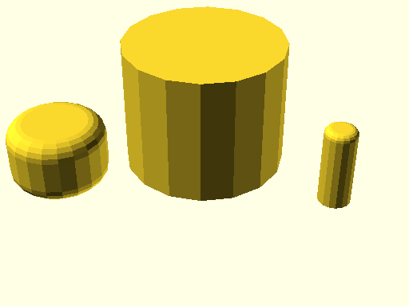
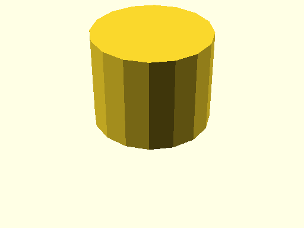
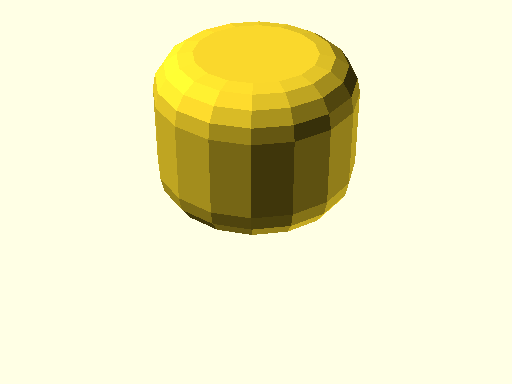
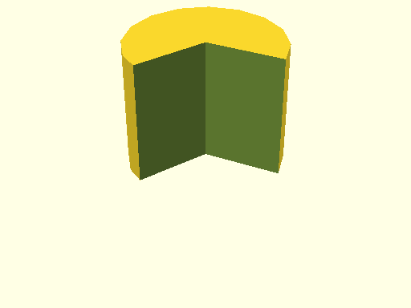
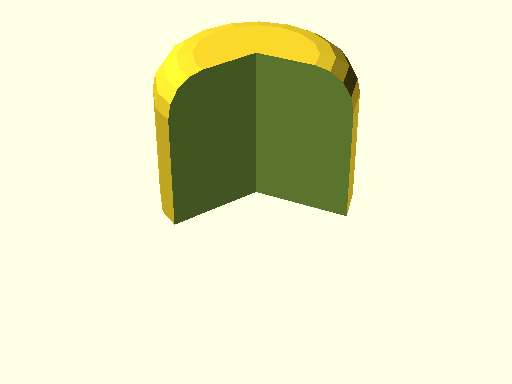

# qbCylinder

Links: ([source](https://github.com/little-blossom/openscad-qbase/blob/master/src/qbCylinder.scad)) ([raw source](https://raw.githubusercontent.com/little-blossom/openscad-qbase/master/src/qbCylinder.scad)) ([package overview](overview.md)) ([documentation home](../index.md))

Cylinder (or slice of it) with optional fillets.

* [Description](#description)
* [Arguments](#arguments)
* [Examples](#examples)
  * [Example 1: Sample cylinders](#example-1-sample-cylinders)
  * [Example 2: Plain cylinder](#example-2-plain-cylinder)
  * [Example 3: Cylinder with fillets](#example-3-cylinder-with-fillets)
  * [Example 4: Cylinder slice](#example-4-cylinder-slice)
  * [Example 5: Cylinder slice with top fillet](#example-5-cylinder-slice-with-top-fillet)

## Description


Cylinder (or slice of it) with optional fillets.

| [](https://github.com/little-blossom/openscad-qbase/blob/master/docs/generated/qbCylinder.md-media/summary-example.png) |
| :---: |
|Example 1: Sample cylinders [(source)](https://github.com/little-blossom/openscad-qbase/blob/master/docs/generated/qbCylinder.md-media/summary-example.scad)[(raw)](https://raw.githubusercontent.com/little-blossom/openscad-qbase/master/docs/generated/qbCylinder.md-media/summary-example.scad)|


## Arguments

<table>
<tr><th>Position</th><th>Name</th><th>Default</th><th>Description</th></tr>
<tr><td>1</td><td><code>r</code></td><td><code>1</code></td><td>Radius of the cylinder.</td></tr>
<tr><td>2</td><td><code>h</code></td><td><code>1</code></td><td>Height of the cylinder.</td></tr>
<tr><td>3</td><td><code>a</code></td><td><code>360</code></td><td>If less than 360, only the cylinder slice from `0` up to `a` degrees is generated.</td></tr>
<tr><td>4</td><td><code>filletTopR</code></td><td><code>undef</code></td><td>Radius of fillet for cylinder's top.</td></tr>
<tr><td>5</td><td><code>filletBottomR</code></td><td><code>undef</code></td><td>Radius of fillet for cylinder's bottom.</td></tr>
<tr><td>6</td><td><code>filletR</code></td><td><code>undef</code></td><td>Radius of fillets for the tob and bottom of the cylinder.</td></tr>
</table>

## Examples

* [Example 1: Sample cylinders](#example-1-sample-cylinders)
* [Example 2: Plain cylinder](#example-2-plain-cylinder)
* [Example 3: Cylinder with fillets](#example-3-cylinder-with-fillets)
* [Example 4: Cylinder slice](#example-4-cylinder-slice)
* [Example 5: Cylinder slice with top fillet](#example-5-cylinder-slice-with-top-fillet)

### Example 1: Sample cylinders


```openscad
use <main.scad>

qbCylinder(r=5, h=8);
translate([-7, -6, 0])
  qbCylinder(r=3, h=4, filletR=1, $fn=20);
translate([9, -1, 0])
  qbCylinder(r=1, h=5, filletTopR=0.4, $fn=16);
```
| [](https://github.com/little-blossom/openscad-qbase/blob/master/docs/generated/qbCylinder.md-media/summary-example.png) |
| :---: |
|Example 1: Sample cylinders [(source)](https://github.com/little-blossom/openscad-qbase/blob/master/docs/generated/qbCylinder.md-media/summary-example.scad)[(raw)](https://raw.githubusercontent.com/little-blossom/openscad-qbase/master/docs/generated/qbCylinder.md-media/summary-example.scad)|


### Example 2: Plain cylinder


```openscad
use <main.scad>

qbCylinder(r=5, h=8);
```
| [](https://github.com/little-blossom/openscad-qbase/blob/master/docs/generated/qbCylinder.md-media/openscad-2.png) |
| :---: |
|Example 2: Plain cylinder [(source)](https://github.com/little-blossom/openscad-qbase/blob/master/docs/generated/qbCylinder.md-media/openscad-2.scad)[(raw)](https://raw.githubusercontent.com/little-blossom/openscad-qbase/master/docs/generated/qbCylinder.md-media/openscad-2.scad)|


### Example 3: Cylinder with fillets


```openscad
use <main.scad>

qbCylinder(r=5, h=8, filletR=2, $fn=16);
```
| [](https://github.com/little-blossom/openscad-qbase/blob/master/docs/generated/qbCylinder.md-media/openscad-3.png) |
| :---: |
|Example 3: Cylinder with fillets [(source)](https://github.com/little-blossom/openscad-qbase/blob/master/docs/generated/qbCylinder.md-media/openscad-3.scad)[(raw)](https://raw.githubusercontent.com/little-blossom/openscad-qbase/master/docs/generated/qbCylinder.md-media/openscad-3.scad)|


### Example 4: Cylinder slice


```openscad
use <main.scad>

qbCylinder(r=5, h=8, a=240);
```
| [](https://github.com/little-blossom/openscad-qbase/blob/master/docs/generated/qbCylinder.md-media/openscad-4.png) |
| :---: |
|Example 4: Cylinder slice [(source)](https://github.com/little-blossom/openscad-qbase/blob/master/docs/generated/qbCylinder.md-media/openscad-4.scad)[(raw)](https://raw.githubusercontent.com/little-blossom/openscad-qbase/master/docs/generated/qbCylinder.md-media/openscad-4.scad)|


### Example 5: Cylinder slice with top fillet


```openscad
use <main.scad>

qbCylinder(r=5, h=8, a=240, filletTopR=2, $fn=16);
```
| [](https://github.com/little-blossom/openscad-qbase/blob/master/docs/generated/qbCylinder.md-media/openscad-5.png) |
| :---: |
|Example 5: Cylinder slice with top fillet [(source)](https://github.com/little-blossom/openscad-qbase/blob/master/docs/generated/qbCylinder.md-media/openscad-5.scad)[(raw)](https://raw.githubusercontent.com/little-blossom/openscad-qbase/master/docs/generated/qbCylinder.md-media/openscad-5.scad)|


Links: ([source](https://github.com/little-blossom/openscad-qbase/blob/master/src/qbCylinder.scad)) ([raw source](https://raw.githubusercontent.com/little-blossom/openscad-qbase/master/src/qbCylinder.scad)) ([package overview](overview.md)) ([documentation home](../index.md))
