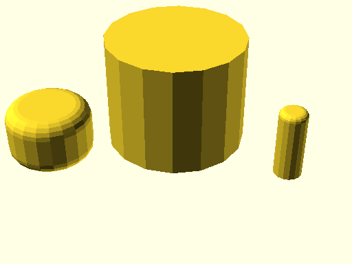

# qbCylinder

Source: [qbCylinder.scad](https://github.com/little-blossom/openscad-qbase/blob/master/qbCylinder.scad) ([raw](https://raw.githubusercontent.com/little-blossom/openscad-qbase/master/qbCylinder.scad))

Cylinder (or slice of it) with optional fillets.

* [Description](#description)
* [Arguments](#arguments)

## Description

Cylinder (or slice of it) with optional fillets.

|  |
| :---: |
|Example 1: Sample cylinders [(source)](https://github.com/little-blossom/openscad-qbase/blob/master/docs/generated/qbCylinder.scad-media/summary-example.scad)[(raw)](https://raw.githubusercontent.com/little-blossom/openscad-qbase/master/docs/generated/qbCylinder.scad-media/summary-example.scad)|

## Arguments

<table>
<tr><th>Position</th><th>Name</th><th>Default</th><th>Description</th></tr>
<tr><td>1</td><td><code>r</code></td><td><code>1</code></td><td>Radius of the cylinder.</td></tr>
<tr><td>2</td><td><code>h</code></td><td><code>1</code></td><td>Height of the cylinder.</td></tr>
<tr><td>3</td><td><code>a</code></td><td><code>360</code></td><td>If less than 360, only the cylinder slice from `0` up to `a` degrees is generated.</td></tr>
<tr><td>4</td><td><code>filletTopR</code></td><td><code>undef</code></td><td>Radius of fillet for cylinder's top.</td></tr>
<tr><td>5</td><td><code>filletBottomR</code></td><td><code>undef</code></td><td>Radius of fillet for cylinder's bottom.</td></tr>
<tr><td>6</td><td><code>filletR</code></td><td><code>undef</code></td><td>Radius of fillets for the tob and bottom of the cylinder.</td></tr>
</table>
