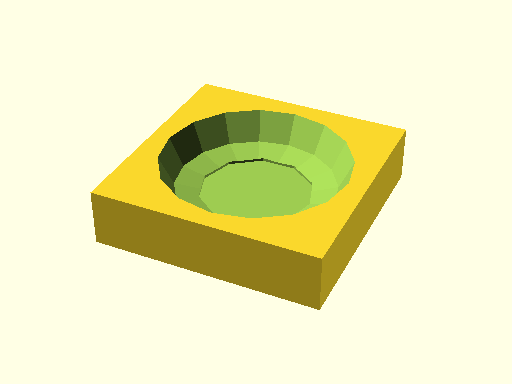

# qbFilletCircle

Source: [qbFilletCircle.scad](https://github.com/little-blossom/openscad-qbase/blob/master/qbFilletCircle.scad) ([raw](https://raw.githubusercontent.com/little-blossom/openscad-qbase/master/qbFilletCircle.scad))

Solid to substract from cylinder to get fillets.

* [Description](#description)
* [Arguments](#arguments)

## Description

Solid to substract from cylinder to get fillets.

|  |
| :---: |
|Example 1: Sample circle fillets [(source)](https://github.com/little-blossom/openscad-qbase/blob/master/docs/generated/qbFilletCircle.scad-media/summary-example.scad)[(raw)](https://raw.githubusercontent.com/little-blossom/openscad-qbase/master/docs/generated/qbFilletCircle.scad-media/summary-example.scad)|

## Arguments

<table>
<tr><th>Position</th><th>Name</th><th>Default</th><th>Description</th></tr>
<tr><td>1</td><td><code>circleR</code></td><td><code>3</code></td><td>Radius of the cylinder.</td></tr>
<tr><td>2</td><td><code>filletR</code></td><td><code>1</code></td><td>Radius of the desired fillet.</td></tr>
</table>
