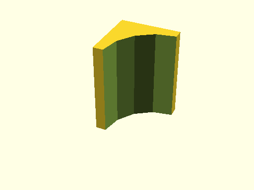

# qbFilletCorner

Links: ([source](https://github.com/little-blossom/openscad-qbase/blob/master/src/qbFilletCorner.scad)) ([raw source](https://raw.githubusercontent.com/little-blossom/openscad-qbase/master/src/qbFilletCorner.scad)) ([package overview](overview.md)) ([documentation home](../index.md))

Solid to substract from an edge to get a fillet.

* [Description](#description)
* [Arguments](#arguments)
* [Examples](#examples)
  * [Example 1: Sample edge fillets](#example-1-sample-edge-fillets)

## Description


Solid to substract from an edge to get a fillet.

| [](https://github.com/little-blossom/openscad-qbase/blob/master/docs/generated/qbFilletCorner.md-media/summary-example.png) |
| :---: |
|Example 1: Sample edge fillets [(source)](https://github.com/little-blossom/openscad-qbase/blob/master/docs/generated/qbFilletCorner.md-media/summary-example.scad)[(raw)](https://raw.githubusercontent.com/little-blossom/openscad-qbase/master/docs/generated/qbFilletCorner.md-media/summary-example.scad)|


## Arguments

<table>
<tr><th>Position</th><th>Name</th><th>Default</th><th>Description</th></tr>
<tr><td>1</td><td><code>r</code></td><td><code>1</code></td><td>Radius of the desired fillet.</td></tr>
<tr><td>2</td><td><code>bottomFrontR</code></td><td><code>undef</code></td><td>Fillet radius for bottom front edge. If undefined, use `r`.</td></tr>
<tr><td>3</td><td><code>bottomLeftR</code></td><td><code>undef</code></td><td>Fillet radius for bottom left edge. If undefined, use `r`.</td></tr>
<tr><td>4</td><td><code>frontLeftR</code></td><td><code>undef</code></td><td>Fillet radius for front left edge. If undefined, use `r`.</td></tr>
<tr><td>5</td><td><code>overshootLeft</code></td><td><code>1</code></td><td>Extra width to the left.</td></tr>
<tr><td>6</td><td><code>overshootFront</code></td><td><code>1</code></td><td>Extra depth to the front.</td></tr>
<tr><td>7</td><td><code>overshootBottom</code></td><td><code>1</code></td><td>Extra height below `0`.</td></tr>
</table>

## Examples

* [Example 1: Sample edge fillets](#example-1-sample-edge-fillets)

### Example 1: Sample edge fillets


```openscad
use <main.scad>

rotate([0, 0, 270]) qbFilletLine(r=5, h=7);
```
| [](https://github.com/little-blossom/openscad-qbase/blob/master/docs/generated/qbFilletCorner.md-media/summary-example.png) |
| :---: |
|Example 1: Sample edge fillets [(source)](https://github.com/little-blossom/openscad-qbase/blob/master/docs/generated/qbFilletCorner.md-media/summary-example.scad)[(raw)](https://raw.githubusercontent.com/little-blossom/openscad-qbase/master/docs/generated/qbFilletCorner.md-media/summary-example.scad)|


Links: ([source](https://github.com/little-blossom/openscad-qbase/blob/master/src/qbFilletCorner.scad)) ([raw source](https://raw.githubusercontent.com/little-blossom/openscad-qbase/master/src/qbFilletCorner.scad)) ([package overview](overview.md)) ([documentation home](../index.md))
