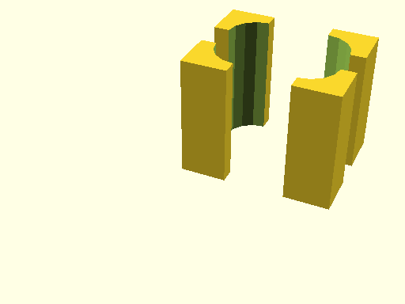

# qbFilletRect

Source: [qbFilletRect.scad](https://github.com/little-blossom/openscad-qbase/blob/master/qbFilletRect.scad) ([raw](https://raw.githubusercontent.com/little-blossom/openscad-qbase/master/qbFilletRect.scad))

Solid to substract from a cube get a fillet along `Z`-edges.

* [Description](#description)
* [Arguments](#arguments)

## Description

Solid to substract from a cube get a fillet along `Z`-edges.

|  |
| :---: |
|Example 1: Sample rect fillets [(source)](https://github.com/little-blossom/openscad-qbase/blob/master/docs/generated/qbFilletRect.scad-media/summary-example.scad)[(raw)](https://raw.githubusercontent.com/little-blossom/openscad-qbase/master/docs/generated/qbFilletRect.scad-media/summary-example.scad)|

## Arguments

<table>
<tr><th>Position</th><th>Name</th><th>Default</th><th>Description</th></tr>
<tr><td>1</td><td><code>size</code></td><td><code>[10, 10, 10]</code></td><td>The size of the cube to get fillets for.</td></tr>
<tr><td>2</td><td><code>frontLeftR</code></td><td><code>undef</code></td><td>Radius of fillet for front left edge.</td></tr>
<tr><td>3</td><td><code>frontRightR</code></td><td><code>undef</code></td><td>Radius of fillet for front right edge.</td></tr>
<tr><td>4</td><td><code>backLeftR</code></td><td><code>undef</code></td><td>Radius of fillet for back left edge.</td></tr>
<tr><td>5</td><td><code>backRightR</code></td><td><code>undef</code></td><td>Radius of fillet for back right edge.</td></tr>
<tr><td>6</td><td><code>r</code></td><td><code>undef</code></td><td>Radius of fillets of all `Z`-edges of the cube.</td></tr>
</table>
