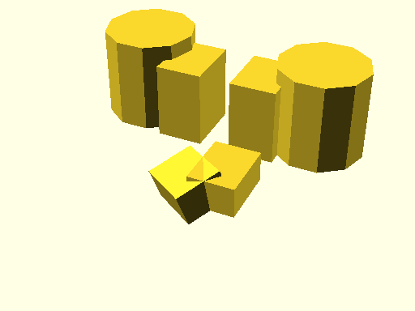
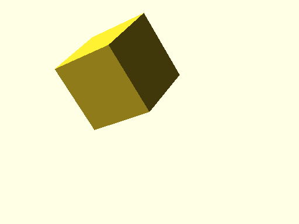
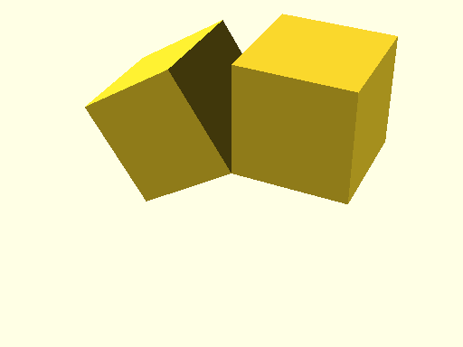

# qbMirror

Links: ([source](https://github.com/little-blossom/openscad-qbase/blob/master/src/qbMirror.scad)) ([raw source](https://raw.githubusercontent.com/little-blossom/openscad-qbase/master/src/qbMirror.scad)) ([package overview](overview.md)) ([documentation home](../index.md))

Mirror of children, while optionally copying them.

* [Description](#description)
* [Arguments](#arguments)
* [Examples](#examples)
  * [Example 1: Sample mirroring](#example-1-sample-mirroring)
  * [Example 2: Mirror without copy](#example-2-mirror-without-copy)
  * [Example 3: Mirror with copy](#example-3-mirror-with-copy)

## Description


Mirror of children, while optionally copying them.

| [](https://github.com/little-blossom/openscad-qbase/blob/master/docs/generated/qbMirror.md-media/summary-example.png) |
| :---: |
|Example 1: Sample mirroring [(source)](https://github.com/little-blossom/openscad-qbase/blob/master/docs/generated/qbMirror.md-media/summary-example.scad)[(raw)](https://raw.githubusercontent.com/little-blossom/openscad-qbase/master/docs/generated/qbMirror.md-media/summary-example.scad)|


## Arguments

<table>
<tr><th>Position</th><th>Name</th><th>Default</th><th>Description</th></tr>
<tr><td>1</td><td><code>normal</code></td><td><code>undef</code></td><td>Normal vector on the mirroring plane.</td></tr>
<tr><td>2</td><td><code>copy</code></td><td><code>false</code></td><td>If true, copy the children before mirroring them.</td></tr>
</table>

## Examples

* [Example 1: Sample mirroring](#example-1-sample-mirroring)
* [Example 2: Mirror without copy](#example-2-mirror-without-copy)
* [Example 3: Mirror with copy](#example-3-mirror-with-copy)

### Example 1: Sample mirroring


```openscad
use <main.scad>

qbMirror([1, 0, 0], copy=true) {
  translate([1, 1, 0]) qbCube([3, 4, 5]);
  translate([6, 4, 0]) qbCylinder(r=3, h=6);
}

translate([1, -5, 0]) qbCube([3, 4, 2]);
qbMirror([1, 0.5, 0.2]) translate([1, -5, 0]) qbCube([3, 4, 2]);
```
| [](https://github.com/little-blossom/openscad-qbase/blob/master/docs/generated/qbMirror.md-media/summary-example.png) |
| :---: |
|Example 1: Sample mirroring [(source)](https://github.com/little-blossom/openscad-qbase/blob/master/docs/generated/qbMirror.md-media/summary-example.scad)[(raw)](https://raw.githubusercontent.com/little-blossom/openscad-qbase/master/docs/generated/qbMirror.md-media/summary-example.scad)|


### Example 2: Mirror without copy


```openscad
use <main.scad>

qbMirror([1, 0, 0.3]) qbCube([7, 7, 7]);
```
| [](https://github.com/little-blossom/openscad-qbase/blob/master/docs/generated/qbMirror.md-media/openscad-2.png) |
| :---: |
|Example 2: Mirror without copy [(source)](https://github.com/little-blossom/openscad-qbase/blob/master/docs/generated/qbMirror.md-media/openscad-2.scad)[(raw)](https://raw.githubusercontent.com/little-blossom/openscad-qbase/master/docs/generated/qbMirror.md-media/openscad-2.scad)|


### Example 3: Mirror with copy


```openscad
use <main.scad>

qbMirror([1, 0, 0.3], copy=true) qbCube([7, 7, 7]);
```
| [](https://github.com/little-blossom/openscad-qbase/blob/master/docs/generated/qbMirror.md-media/openscad-3.png) |
| :---: |
|Example 3: Mirror with copy [(source)](https://github.com/little-blossom/openscad-qbase/blob/master/docs/generated/qbMirror.md-media/openscad-3.scad)[(raw)](https://raw.githubusercontent.com/little-blossom/openscad-qbase/master/docs/generated/qbMirror.md-media/openscad-3.scad)|


Links: ([source](https://github.com/little-blossom/openscad-qbase/blob/master/src/qbMirror.scad)) ([raw source](https://raw.githubusercontent.com/little-blossom/openscad-qbase/master/src/qbMirror.scad)) ([package overview](overview.md)) ([documentation home](../index.md))
