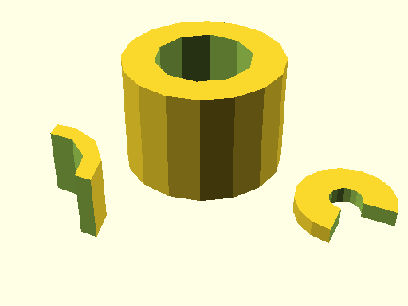
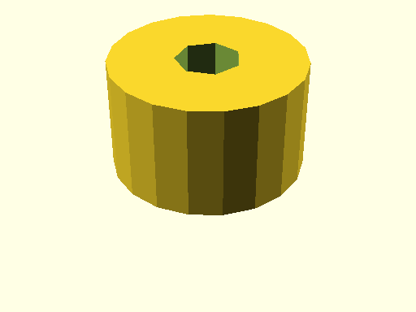
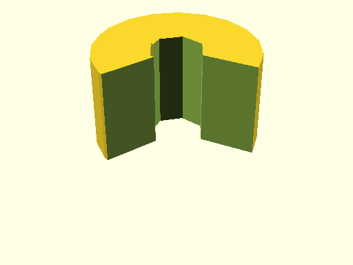

# qbPipe

Links: ([source](https://github.com/little-blossom/openscad-qbase/blob/master/src/qbPipe.scad)) ([raw source](https://raw.githubusercontent.com/little-blossom/openscad-qbase/master/src/qbPipe.scad)) ([package overview](overview.md)) ([documentation home](../index.md))

Pipe (or slice of it).

* [Description](#description)
* [Arguments](#arguments)
* [Examples](#examples)
  * [Example 1: Sample pipes](#example-1-sample-pipes)
  * [Example 2: Plain pipe](#example-2-plain-pipe)
  * [Example 3: Pipe slice](#example-3-pipe-slice)

## Description


Pipe (or slice of it).

| [](https://github.com/little-blossom/openscad-qbase/blob/master/docs/generated/qbPipe.md-media/summary-example.png) |
| :---: |
|Example 1: Sample pipes [(source)](https://github.com/little-blossom/openscad-qbase/blob/master/docs/generated/qbPipe.md-media/summary-example.scad)[(raw)](https://raw.githubusercontent.com/little-blossom/openscad-qbase/master/docs/generated/qbPipe.md-media/summary-example.scad)|


## Arguments

<table>
<tr><th>Position</th><th>Name</th><th>Default</th><th>Description</th></tr>
<tr><td>1</td><td><code>r1</code></td><td><code>2</code></td><td>Outer radius of the pipe.</td></tr>
<tr><td>2</td><td><code>r2</code></td><td><code>1</code></td><td>Inner radius of the pipe.</td></tr>
<tr><td>3</td><td><code>h</code></td><td><code>1</code></td><td>Height of the pipe.</td></tr>
<tr><td>4</td><td><code>a</code></td><td><code>360</code></td><td>If less than 360, only the slice from `0` up to `a` degrees is generated.</td></tr>
</table>

## Examples

* [Example 1: Sample pipes](#example-1-sample-pipes)
* [Example 2: Plain pipe](#example-2-plain-pipe)
* [Example 3: Pipe slice](#example-3-pipe-slice)

### Example 1: Sample pipes


```openscad
use <main.scad>

qbPipe(r1=5, r2=3, h=7);
translate([-6, -10, 0])
  qbPipe(r1=4, r2=3, h=4, a=100);
translate([10, -2, 0])
  qbPipe(r1=3, r2=1, h=1, a=270, $fn=16);
```
| [](https://github.com/little-blossom/openscad-qbase/blob/master/docs/generated/qbPipe.md-media/summary-example.png) |
| :---: |
|Example 1: Sample pipes [(source)](https://github.com/little-blossom/openscad-qbase/blob/master/docs/generated/qbPipe.md-media/summary-example.scad)[(raw)](https://raw.githubusercontent.com/little-blossom/openscad-qbase/master/docs/generated/qbPipe.md-media/summary-example.scad)|


### Example 2: Plain pipe


```openscad
use <main.scad>

qbPipe(r1=6, r2=2, h=7);
```
| [](https://github.com/little-blossom/openscad-qbase/blob/master/docs/generated/qbPipe.md-media/openscad-2.png) |
| :---: |
|Example 2: Plain pipe [(source)](https://github.com/little-blossom/openscad-qbase/blob/master/docs/generated/qbPipe.md-media/openscad-2.scad)[(raw)](https://raw.githubusercontent.com/little-blossom/openscad-qbase/master/docs/generated/qbPipe.md-media/openscad-2.scad)|


### Example 3: Pipe slice


```openscad
use <main.scad>

qbPipe(r1=6, r2=2, h=7, a=240);
```
| [](https://github.com/little-blossom/openscad-qbase/blob/master/docs/generated/qbPipe.md-media/openscad-3.png) |
| :---: |
|Example 3: Pipe slice [(source)](https://github.com/little-blossom/openscad-qbase/blob/master/docs/generated/qbPipe.md-media/openscad-3.scad)[(raw)](https://raw.githubusercontent.com/little-blossom/openscad-qbase/master/docs/generated/qbPipe.md-media/openscad-3.scad)|


Links: ([source](https://github.com/little-blossom/openscad-qbase/blob/master/src/qbPipe.scad)) ([raw source](https://raw.githubusercontent.com/little-blossom/openscad-qbase/master/src/qbPipe.scad)) ([package overview](overview.md)) ([documentation home](../index.md))
