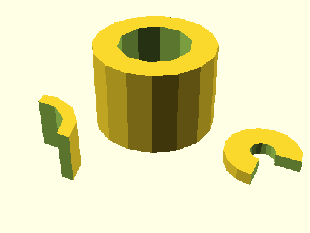

# qbPipe

Source: [qbPipe.scad](https://github.com/little-blossom/openscad-qbase/blob/master/qbPipe.scad) ([raw](https://raw.githubusercontent.com/little-blossom/openscad-qbase/master/qbPipe.scad))

Pipe (or slice of it).

* [Description](#description)
* [Arguments](#arguments)

## Description

Pipe (or slice of it).

|  |
| :---: |
|Example 1: Sample tori [(source)](https://github.com/little-blossom/openscad-qbase/blob/master/docs/generated/qbPipe.scad-media/summary-example.scad)[(raw)](https://raw.githubusercontent.com/little-blossom/openscad-qbase/master/docs/generated/qbPipe.scad-media/summary-example.scad)|

## Arguments

<table>
<tr><th>Position</th><th>Name</th><th>Default</th><th>Description</th></tr>
<tr><td>1</td><td><code>r1</code></td><td><code>2</code></td><td>Outer radius of the pipe.</td></tr>
<tr><td>2</td><td><code>r2</code></td><td><code>1</code></td><td>Inner radius of the pipe.</td></tr>
<tr><td>3</td><td><code>h</code></td><td><code>1</code></td><td>Height of the pipe.</td></tr>
<tr><td>4</td><td><code>a</code></td><td><code>360</code></td><td>If less than 360, only the slice from `0` up to `a` degrees is generated.</td></tr>
</table>
