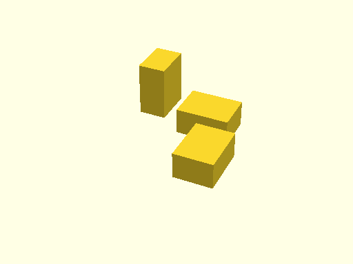
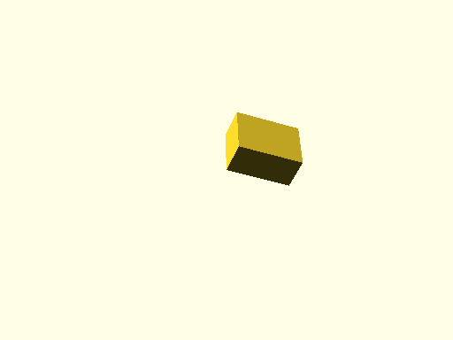
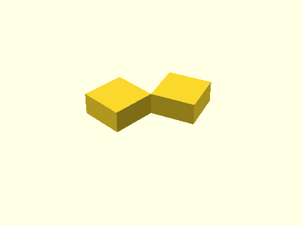
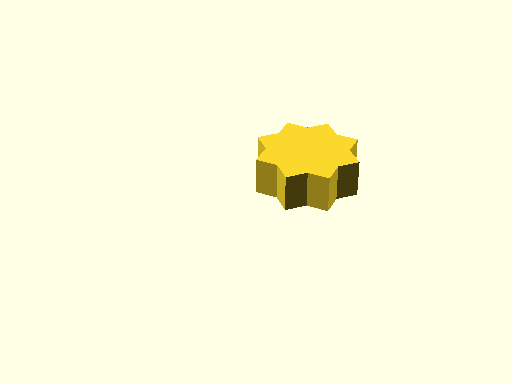

# qbRotate

Links: ([source](https://github.com/little-blossom/openscad-qbase/blob/master/src/qbRotate.scad)) ([raw source](https://raw.githubusercontent.com/little-blossom/openscad-qbase/master/src/qbRotate.scad)) ([package overview](overview.md)) ([documentation home](../index.md))

Rotate children around given point.

* [Description](#description)
* [Arguments](#arguments)
* [Examples](#examples)
  * [Example 1: Sample mirroring](#example-1-sample-mirroring)
  * [Example 2: Rotation around vector](#example-2-rotation-around-vector)
  * [Example 3: Rotation around single axis](#example-3-rotation-around-single-axis)
  * [Example 4: Rotation around a given point](#example-4-rotation-around-a-given-point)

## Description


Rotate children around given point.

| [](https://github.com/little-blossom/openscad-qbase/blob/master/docs/generated/qbRotate.md-media/summary-example.png) |
| :---: |
|Example 1: Sample mirroring [(source)](https://github.com/little-blossom/openscad-qbase/blob/master/docs/generated/qbRotate.md-media/summary-example.scad)[(raw)](https://raw.githubusercontent.com/little-blossom/openscad-qbase/master/docs/generated/qbRotate.md-media/summary-example.scad)|


## Arguments

<table>
<tr><th>Position</th><th>Name</th><th>Default</th><th>Description</th></tr>
<tr><td>1</td><td><code>v</code></td><td><code>undef</code></td><td>Rotation (in degrees) vector.</td></tr>
<tr><td>2</td><td><code>x</code></td><td><code>undef</code></td><td>Rotation (in degrees) around X-axis. This overrides `v[0]`.</td></tr>
<tr><td>3</td><td><code>y</code></td><td><code>undef</code></td><td>Rotation (in degrees) around Y-axis. This overrides `v[1]`.</td></tr>
<tr><td>4</td><td><code>z</code></td><td><code>undef</code></td><td>Rotation (in degrees) around Z-axis. This overrides `v[2]`.</td></tr>
<tr><td>5</td><td><code>at</code></td><td><code>[0, 0, 0]</code></td><td>Center of rotation.</td></tr>
</table>

## Examples

* [Example 1: Sample mirroring](#example-1-sample-mirroring)
* [Example 2: Rotation around vector](#example-2-rotation-around-vector)
* [Example 3: Rotation around single axis](#example-3-rotation-around-single-axis)
* [Example 4: Rotation around a given point](#example-4-rotation-around-a-given-point)

### Example 1: Sample mirroring


```openscad
use <main.scad>

qbCube([4, 3, 2]);
qbRotate(z=90, at=[5, 0, 0]) qbCube([4, 3, 2]);
qbRotate(y=-90, at=[-1, 0, 0]) qbCube([4, 3, 2]);
```
| [](https://github.com/little-blossom/openscad-qbase/blob/master/docs/generated/qbRotate.md-media/summary-example.png) |
| :---: |
|Example 1: Sample mirroring [(source)](https://github.com/little-blossom/openscad-qbase/blob/master/docs/generated/qbRotate.md-media/summary-example.scad)[(raw)](https://raw.githubusercontent.com/little-blossom/openscad-qbase/master/docs/generated/qbRotate.md-media/summary-example.scad)|


### Example 2: Rotation around vector


```openscad
use <main.scad>

qbRotate([10, 20, 30]) qbCube([4, 3, 2]);
```
| [](https://github.com/little-blossom/openscad-qbase/blob/master/docs/generated/qbRotate.md-media/openscad-2.png) |
| :---: |
|Example 2: Rotation around vector [(source)](https://github.com/little-blossom/openscad-qbase/blob/master/docs/generated/qbRotate.md-media/openscad-2.scad)[(raw)](https://raw.githubusercontent.com/little-blossom/openscad-qbase/master/docs/generated/qbRotate.md-media/openscad-2.scad)|


### Example 3: Rotation around single axis


```openscad
use <main.scad>

qbCube([4, 4, 2]);
qbRotate(z=160) qbCube([4, 4, 2]);
```
| [](https://github.com/little-blossom/openscad-qbase/blob/master/docs/generated/qbRotate.md-media/openscad-3.png) |
| :---: |
|Example 3: Rotation around single axis [(source)](https://github.com/little-blossom/openscad-qbase/blob/master/docs/generated/qbRotate.md-media/openscad-3.scad)[(raw)](https://raw.githubusercontent.com/little-blossom/openscad-qbase/master/docs/generated/qbRotate.md-media/openscad-3.scad)|


### Example 4: Rotation around a given point


```openscad
use <main.scad>

qbCube([4, 4, 2]);
qbRotate(z=45, at=[2, 2, 1]) qbCube([4, 4, 2]);
```
| [](https://github.com/little-blossom/openscad-qbase/blob/master/docs/generated/qbRotate.md-media/openscad-4.png) |
| :---: |
|Example 4: Rotation around a given point [(source)](https://github.com/little-blossom/openscad-qbase/blob/master/docs/generated/qbRotate.md-media/openscad-4.scad)[(raw)](https://raw.githubusercontent.com/little-blossom/openscad-qbase/master/docs/generated/qbRotate.md-media/openscad-4.scad)|


Links: ([source](https://github.com/little-blossom/openscad-qbase/blob/master/src/qbRotate.scad)) ([raw source](https://raw.githubusercontent.com/little-blossom/openscad-qbase/master/src/qbRotate.scad)) ([package overview](overview.md)) ([documentation home](../index.md))
