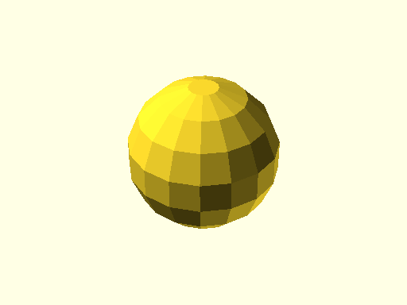

# qbSphere

Source: [qbSphere.scad](https://github.com/little-blossom/openscad-qbase/blob/master/qbSphere.scad) ([raw](https://raw.githubusercontent.com/little-blossom/openscad-qbase/master/qbSphere.scad))

Sphere.

* [Description](#description)
* [Arguments](#arguments)

## Description

Sphere.

|  |
| :---: |
|Example 1: Sample sphere [(source)](https://github.com/little-blossom/openscad-qbase/blob/master/docs/generated/qbSphere.scad-media/summary-example.scad)[(raw)](https://raw.githubusercontent.com/little-blossom/openscad-qbase/master/docs/generated/qbSphere.scad-media/summary-example.scad)|

## Arguments

<table>
<tr><th>Position</th><th>Name</th><th>Default</th><th>Description</th></tr>
<tr><td>1</td><td><code>r</code></td><td><code>1</code></td><td>Radius of the sphere.</td></tr>
</table>
