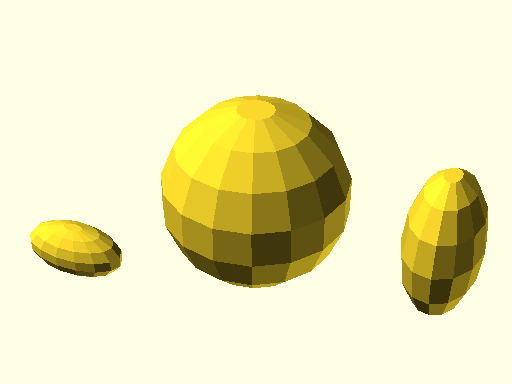

# qbSphere

Links: ([source](https://github.com/little-blossom/openscad-qbase/blob/master/src/qbSphere.scad)) ([raw source](https://raw.githubusercontent.com/little-blossom/openscad-qbase/master/src/qbSphere.scad)) ([package overview](overview.md)) ([documentation home](../index.md))

Sphere.

* [Description](#description)
* [Arguments](#arguments)
* [Examples](#examples)
  * [Example 1: Sample sphere](#example-1-sample-sphere)

## Description


Sphere.

| [](https://github.com/little-blossom/openscad-qbase/blob/master/docs/generated/qbSphere.md-media/summary-example.png) |
| :---: |
|Example 1: Sample sphere [(source)](https://github.com/little-blossom/openscad-qbase/blob/master/docs/generated/qbSphere.md-media/summary-example.scad)[(raw)](https://raw.githubusercontent.com/little-blossom/openscad-qbase/master/docs/generated/qbSphere.md-media/summary-example.scad)|


## Arguments

<table>
<tr><th>Position</th><th>Name</th><th>Default</th><th>Description</th></tr>
<tr><td>1</td><td><code>r</code></td><td><code>1</code></td><td>Radius of the sphere.</td></tr>
</table>

## Examples

* [Example 1: Sample sphere](#example-1-sample-sphere)

### Example 1: Sample sphere


```openscad
use <main.scad>

qbSphere(r=5);
```
| [](https://github.com/little-blossom/openscad-qbase/blob/master/docs/generated/qbSphere.md-media/summary-example.png) |
| :---: |
|Example 1: Sample sphere [(source)](https://github.com/little-blossom/openscad-qbase/blob/master/docs/generated/qbSphere.md-media/summary-example.scad)[(raw)](https://raw.githubusercontent.com/little-blossom/openscad-qbase/master/docs/generated/qbSphere.md-media/summary-example.scad)|


Links: ([source](https://github.com/little-blossom/openscad-qbase/blob/master/src/qbSphere.scad)) ([raw source](https://raw.githubusercontent.com/little-blossom/openscad-qbase/master/src/qbSphere.scad)) ([package overview](overview.md)) ([documentation home](../index.md))
