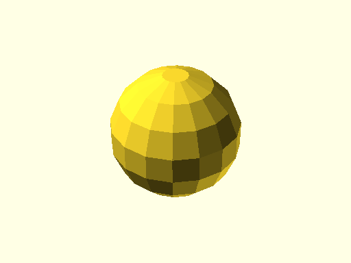
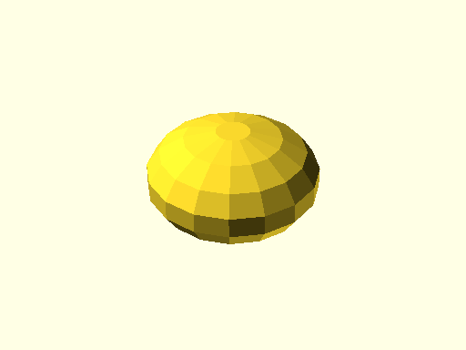

# qbSphere

Links: ([source](https://github.com/little-blossom/openscad-qbase/blob/master/docs/generated/src/qbSphere.scad)) ([raw source](https://raw.githubusercontent.com/little-blossom/openscad-qbase/master/docs/generated/src/qbSphere.scad)) ([package overview](overview.md)) ([documentation home](../index.md))

Sphere.

* [Description](#description)
* [Arguments](#arguments)
* [Examples](#examples)
  * [Example 1: Sample sphere](#example-1-sample-sphere)
  * [Example 2: Uniform sphere](#example-2-uniform-sphere)
  * [Example 3: Non-uniform sphere](#example-3-non-uniform-sphere)

## Description


Sphere.

| [](https://github.com/little-blossom/openscad-qbase/blob/master/docs/generated/qbSphere.md-media/summary-example.png) |
| :---: |
|Example 1: Sample sphere [(source)](https://github.com/little-blossom/openscad-qbase/blob/master/docs/generated/qbSphere.md-media/summary-example.scad)[(raw)](https://raw.githubusercontent.com/little-blossom/openscad-qbase/master/docs/generated/qbSphere.md-media/summary-example.scad)|


## Arguments

<table>
<tr><th>Position</th><th>Name</th><th>Default</th><th>Description</th></tr>
<tr><td>1</td><td><code>r</code></td><td><code>1</code></td><td>Default radius of the sphere (see also `rX`, `rY`, and `rZ`).</td></tr>
<tr><td>2</td><td><code>rX</code></td><td><code>undef</code></td><td>Radius of the sphere in X direction. If undefined, use `r`.</td></tr>
<tr><td>3</td><td><code>rY</code></td><td><code>undef</code></td><td>Radius of the sphere in Y direction. If undefined, use `r`.</td></tr>
<tr><td>4</td><td><code>rZ</code></td><td><code>undef</code></td><td>Radius of the sphere in Z direction. If undefined, use `r`.</td></tr>
</table>

## Examples

* [Example 1: Sample sphere](#example-1-sample-sphere)
* [Example 2: Uniform sphere](#example-2-uniform-sphere)
* [Example 3: Non-uniform sphere](#example-3-non-uniform-sphere)

### Example 1: Sample sphere


```openscad
use <main.scad>

qbSphere(r=5);
translate([10, 0, 0]) qbSphere(rX=2, rY=3, rZ=4);
translate([-1, -14, 6]) qbSphere(rX=2, rY=1, rZ=1, $fn=15);
```
| [](https://github.com/little-blossom/openscad-qbase/blob/master/docs/generated/qbSphere.md-media/summary-example.png) |
| :---: |
|Example 1: Sample sphere [(source)](https://github.com/little-blossom/openscad-qbase/blob/master/docs/generated/qbSphere.md-media/summary-example.scad)[(raw)](https://raw.githubusercontent.com/little-blossom/openscad-qbase/master/docs/generated/qbSphere.md-media/summary-example.scad)|


### Example 2: Uniform sphere


```openscad
use <main.scad>

qbSphere(r=5);
```
| [](https://github.com/little-blossom/openscad-qbase/blob/master/docs/generated/qbSphere.md-media/openscad-2.png) |
| :---: |
|Example 2: Uniform sphere [(source)](https://github.com/little-blossom/openscad-qbase/blob/master/docs/generated/qbSphere.md-media/openscad-2.scad)[(raw)](https://raw.githubusercontent.com/little-blossom/openscad-qbase/master/docs/generated/qbSphere.md-media/openscad-2.scad)|


### Example 3: Non-uniform sphere


```openscad
use <main.scad>

qbSphere(r=5, rZ=3);
```
| [](https://github.com/little-blossom/openscad-qbase/blob/master/docs/generated/qbSphere.md-media/openscad-3.png) |
| :---: |
|Example 3: Non-uniform sphere [(source)](https://github.com/little-blossom/openscad-qbase/blob/master/docs/generated/qbSphere.md-media/openscad-3.scad)[(raw)](https://raw.githubusercontent.com/little-blossom/openscad-qbase/master/docs/generated/qbSphere.md-media/openscad-3.scad)|


Links: ([source](https://github.com/little-blossom/openscad-qbase/blob/master/docs/generated/src/qbSphere.scad)) ([raw source](https://raw.githubusercontent.com/little-blossom/openscad-qbase/master/docs/generated/src/qbSphere.scad)) ([package overview](overview.md)) ([documentation home](../index.md))
