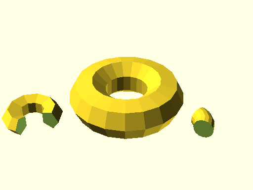

# qbTorus

Source: [qbTorus.scad](https://github.com/little-blossom/openscad-qbase/blob/master/qbTorus.scad) ([raw](https://raw.githubusercontent.com/little-blossom/openscad-qbase/master/qbTorus.scad))

Torus (or slice of it).

* [Description](#description)
* [Arguments](#arguments)

## Description

Torus (or slice of it).

|  |
| :---: |
|Example 1: Sample tori [(source)](https://github.com/little-blossom/openscad-qbase/blob/master/docs/generated/qbTorus.scad-media/summary-example.scad)[(raw)](https://raw.githubusercontent.com/little-blossom/openscad-qbase/master/docs/generated/qbTorus.scad-media/summary-example.scad)|

This module can only generate non-intersecting tori. So `r1` has to be strictly smaller than `r2`.

## Arguments

<table>
<tr><th>Position</th><th>Name</th><th>Default</th><th>Description</th></tr>
<tr><td>1</td><td><code>r1</code></td><td><code>1</code></td><td>Radius of the tube.</td></tr>
<tr><td>2</td><td><code>r2</code></td><td><code>2</code></td><td>Distance from the center of the tube to the center of the torus.</td></tr>
<tr><td>3</td><td><code>a</code></td><td><code>360</code></td><td>If less than 360, only the torus slice from `0` up to `a` degrees is generated.</td></tr>
</table>
