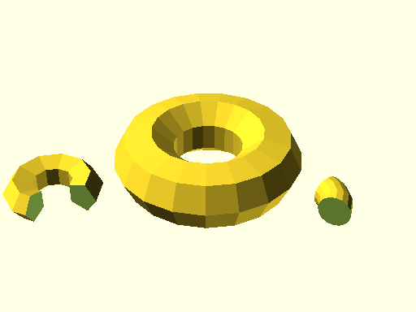
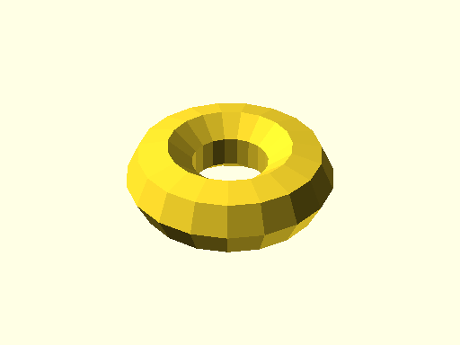
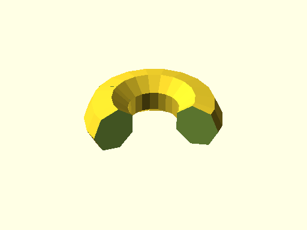

# qbTorus

Links: ([source](https://github.com/little-blossom/openscad-qbase/blob/master/qbTorus.scad)) ([raw source](https://raw.githubusercontent.com/little-blossom/openscad-qbase/master/qbTorus.scad)) ([package overview](overview.md)) ([documentation home](../index.md))

Torus (or slice of it).

* [Description](#description)
* [Arguments](#arguments)
* [Examples](#examples)
  * [Example 1: Sample tori](#example-1-sample-tori)
  * [Example 2: Plain torus](#example-2-plain-torus)
  * [Example 3: Torus slice](#example-3-torus-slice)

## Description


Torus (or slice of it).

| [](https://github.com/little-blossom/openscad-qbase/blob/master/docs/generated/qbTorus.md-media/summary-example.png) |
| :---: |
|Example 1: Sample tori [(source)](https://github.com/little-blossom/openscad-qbase/blob/master/docs/generated/qbTorus.md-media/summary-example.scad)[(raw)](https://raw.githubusercontent.com/little-blossom/openscad-qbase/master/docs/generated/qbTorus.md-media/summary-example.scad)|


This module can only generate non-intersecting tori. So `r1` has to be strictly smaller than `r2`.


## Arguments

<table>
<tr><th>Position</th><th>Name</th><th>Default</th><th>Description</th></tr>
<tr><td>1</td><td><code>r1</code></td><td><code>1</code></td><td>Radius of the tube.</td></tr>
<tr><td>2</td><td><code>r2</code></td><td><code>2</code></td><td>Distance from the center of the tube to the center of the torus.</td></tr>
<tr><td>3</td><td><code>a</code></td><td><code>360</code></td><td>If less than 360, only the torus slice from `0` up to `a` degrees is generated.</td></tr>
</table>

## Examples

* [Example 1: Sample tori](#example-1-sample-tori)
* [Example 2: Plain torus](#example-2-plain-torus)
* [Example 3: Torus slice](#example-3-torus-slice)

### Example 1: Sample tori


```openscad
use <main.scad>

qbTorus(r1=2, r2=4);
translate([-7, -7, 0]) qbTorus(r1=1, r2=2, a=270);
translate([7, -2, 0]) qbTorus(r1=1, r2=2, a=60, $fn=16);
```
| [](https://github.com/little-blossom/openscad-qbase/blob/master/docs/generated/qbTorus.md-media/summary-example.png) |
| :---: |
|Example 1: Sample tori [(source)](https://github.com/little-blossom/openscad-qbase/blob/master/docs/generated/qbTorus.md-media/summary-example.scad)[(raw)](https://raw.githubusercontent.com/little-blossom/openscad-qbase/master/docs/generated/qbTorus.md-media/summary-example.scad)|


### Example 2: Plain torus


```openscad
use <main.scad>

qbTorus(r1=2, r2=4);
```
| [](https://github.com/little-blossom/openscad-qbase/blob/master/docs/generated/qbTorus.md-media/openscad-2.png) |
| :---: |
|Example 2: Plain torus [(source)](https://github.com/little-blossom/openscad-qbase/blob/master/docs/generated/qbTorus.md-media/openscad-2.scad)[(raw)](https://raw.githubusercontent.com/little-blossom/openscad-qbase/master/docs/generated/qbTorus.md-media/openscad-2.scad)|


### Example 3: Torus slice


```openscad
use <main.scad>

qbTorus(r1=2, r2=4, a=240);
```
| [](https://github.com/little-blossom/openscad-qbase/blob/master/docs/generated/qbTorus.md-media/openscad-3.png) |
| :---: |
|Example 3: Torus slice [(source)](https://github.com/little-blossom/openscad-qbase/blob/master/docs/generated/qbTorus.md-media/openscad-3.scad)[(raw)](https://raw.githubusercontent.com/little-blossom/openscad-qbase/master/docs/generated/qbTorus.md-media/openscad-3.scad)|


Links: ([source](https://github.com/little-blossom/openscad-qbase/blob/master/qbTorus.scad)) ([raw source](https://raw.githubusercontent.com/little-blossom/openscad-qbase/master/qbTorus.scad)) ([package overview](overview.md)) ([documentation home](../index.md))
